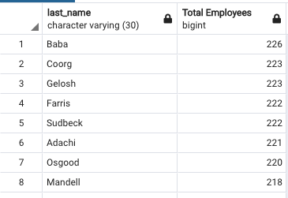

# employee-database

This repository includes:

      An ERD diagram showing the relationship between tables for employee data
      
  
      
      The schema used for creating the tables, primary keys and foreign keys
      
      And the postgreSQL queries to return the following outputs:
      
      
A list of the following details of each employee: employee number, last name, first name, sex, and salary.

           
A list with the first name, last name, and hire date for employees who were hired in 1986.

A list of managers for each department with the following information: department number, department name, the manager's employee number, last name, first name.

A list of the department of each employee with the following information: employee number, last name, first name, and department name.

A list with the first name, last name, and sex for employees whose first name is "Hercules" and last names begin with "B."

A list of all employees in the Sales department, including their employee number, last name, first name, and department name.

A list of all employees in the Sales and Development departments, including their employee number, last name, first name, and department name.

The frequency count in descending order of employee last names, i.e., how many employees share each last name.

